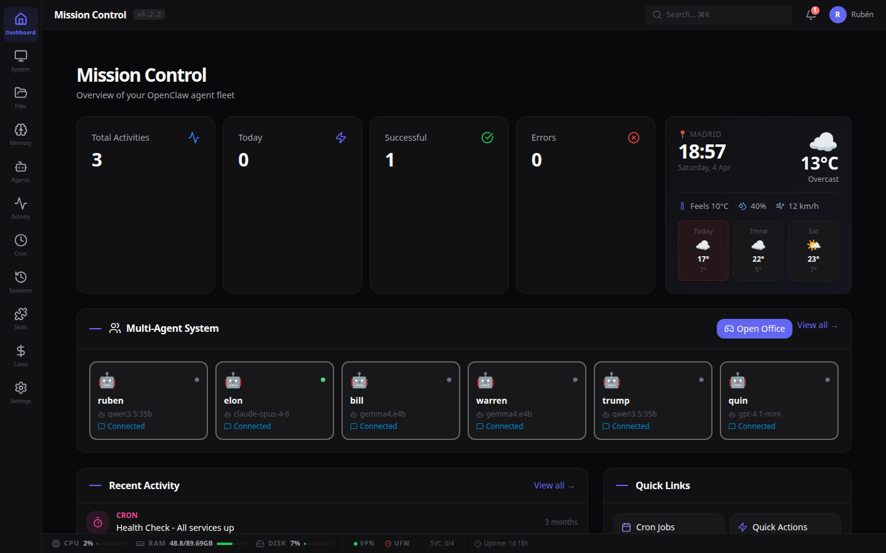
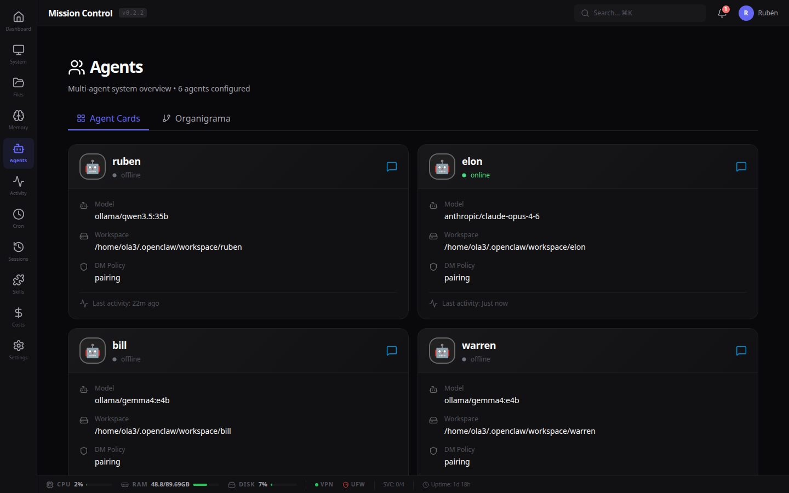
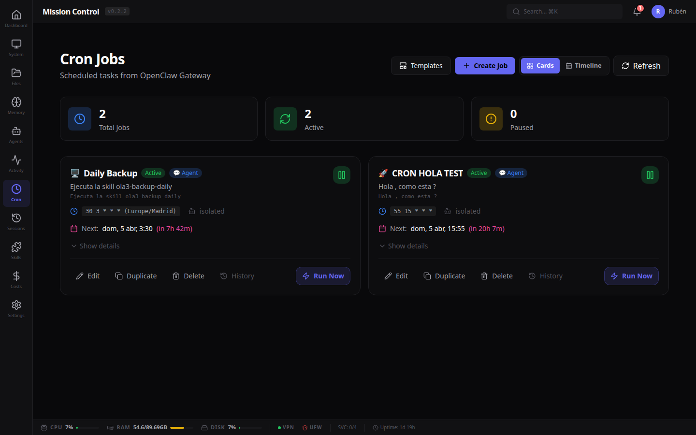
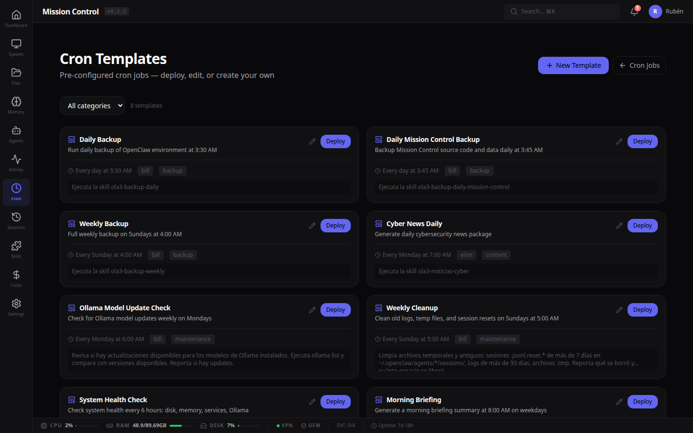
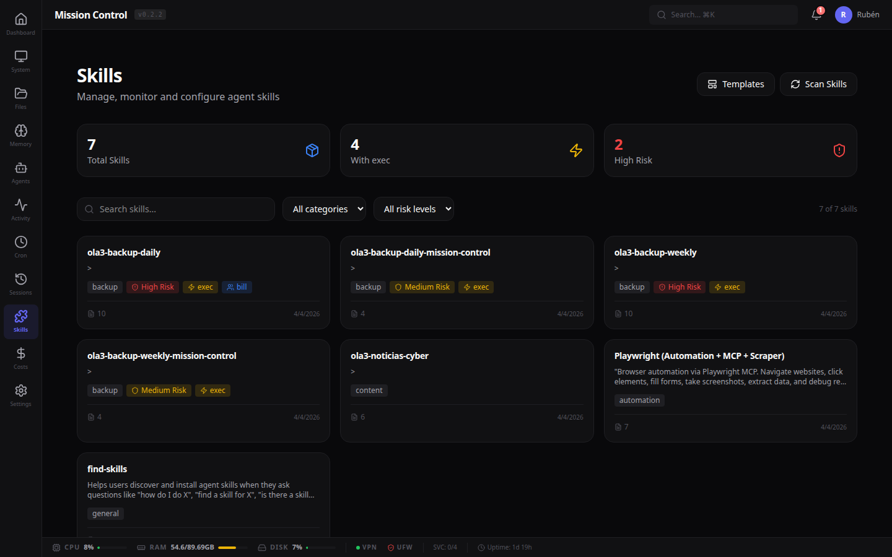
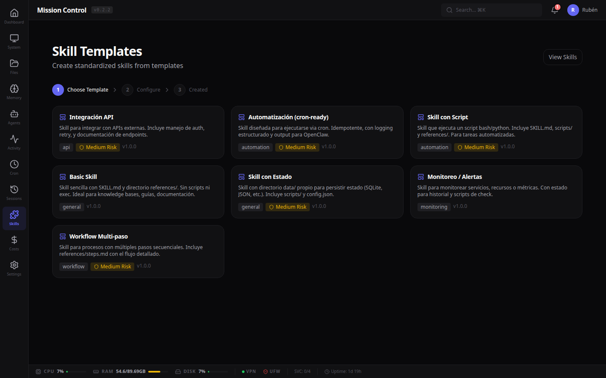
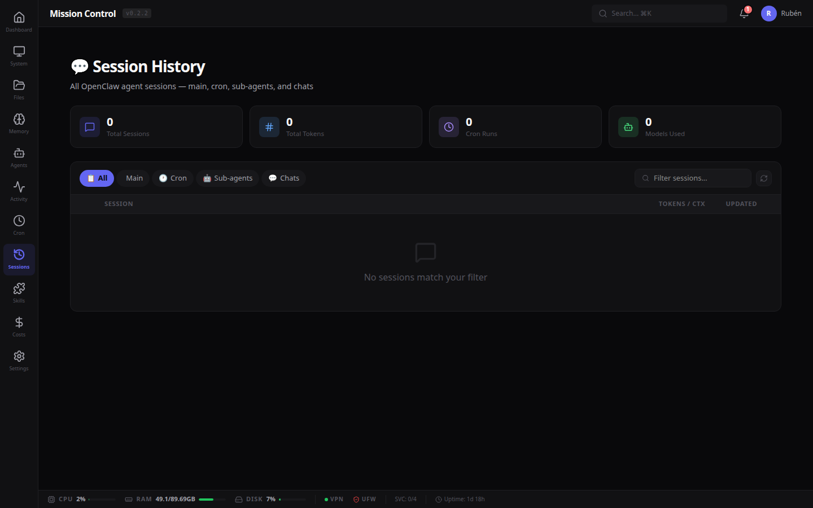
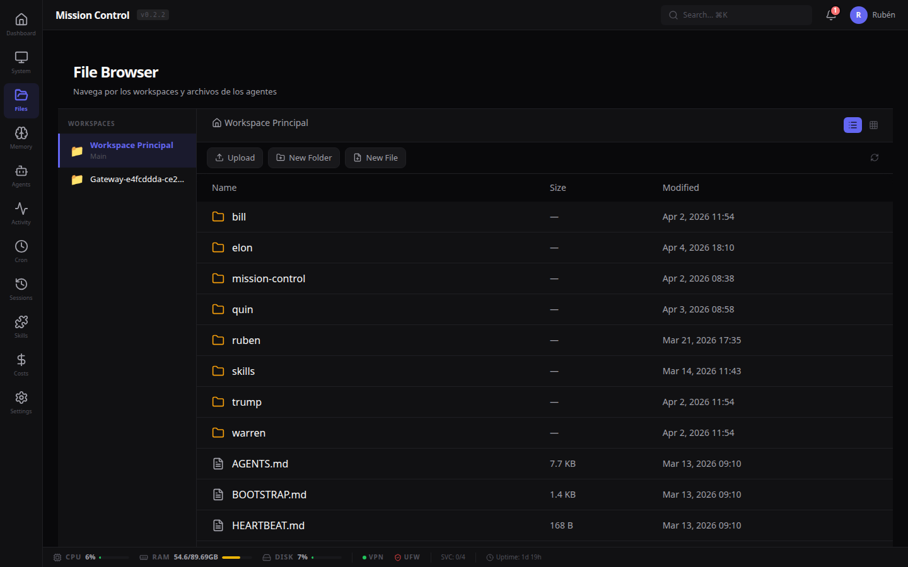
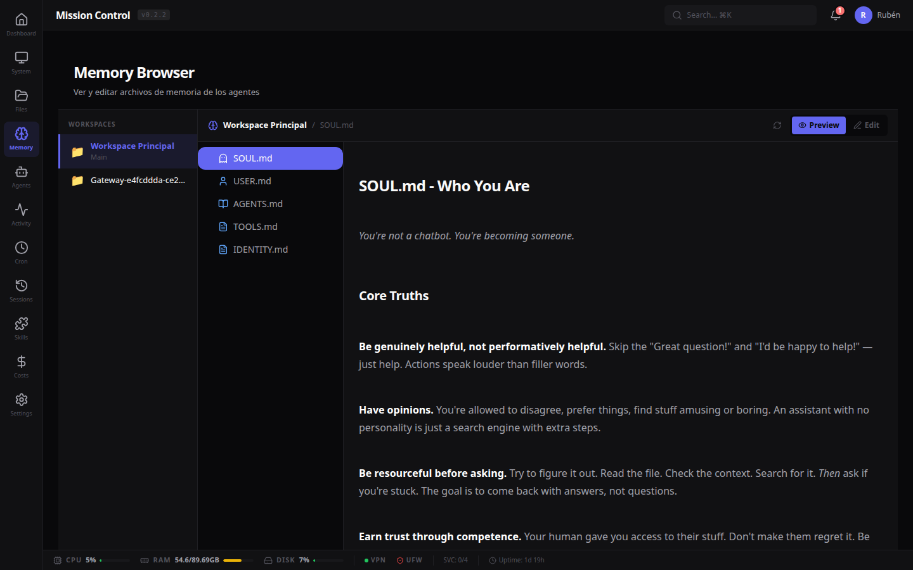

<div align="center">


# Mission Control

### Command center for OpenClaw AI agent fleets

[](https://nextjs.org)
[](https://www.typescriptlang.org)
[](https://sqlite.org)
[](LICENSE)
[](https://github.com/openclaw/openclaw)
[](https://github.com/psiquis/openclaw-mission-control/releases/tag/v0.3.0)

**Real-time fleet monitoring · Smart cron scheduling · Skill management · Full observability**

[Quick Start](#-quick-start) · [Features](#-features) · [Screenshots](#-screenshots) · [Architecture](#-architecture) · [Contributing](#-contributing)

</div>

---

## ✨ What's New

> **v0.3.0** — May 2026

- 🖥️ **System Cron Jobs** — New section on the `/cron` page to view and manage the system crontab — add, edit, and delete entries inline with human-readable schedule descriptions
- 🗑️ **Delete button in Cron Modal** — Delete any OpenClaw cron job directly from its edit modal, no need to go back to the list
- 🌐 **New API** — `GET/POST/PUT/DELETE /api/cron/system` for full system crontab management

<details>
<summary>Previous releases</summary>

> **v0.3.0** — April 2026

- 🔧 **Smart Cron Presets** — One-click task profiles: _Script directo_, _Tarea de agente_, _Respuesta simple_, or fully custom
- 💡 **Inline Tooltips** — Contextual `ℹ️` hints on every cron field so you never misconfigure a job
- 📢 **Simplified Delivery** — Single checkbox to route results to Telegram, auto-configured per agent
- ⚡ **Run Now Fix** — Instant manual cron execution from the dashboard
- 📊 **Weekly Timeline** — Visual cron schedule across the week
- 🗂️ **Cron Templates** — 8 pre-built automation templates ready to deploy
- 🎯 **Cron Categories** — Organize jobs by type (backup, monitoring, content, etc.)

</details>

---

## 📸 Screenshots

<table>
<tr>
<td width="50%">

**Dashboard — Fleet Overview**

*Real-time agent status, activity feed, weather, system metrics, and quick links*

</td>
<td width="50%">

**Agent Fleet**

*Multi-agent overview with models, status, and configuration*

</td>
</tr>
<tr>
<td>

**Cron Scheduler**

*Full cron management with smart presets, tooltips, and visual timeline*

</td>
<td>

**Cron Templates**

*Pre-built automation templates — deploy with one click*

</td>
</tr>
<tr>
<td>

**Skill Registry**

*SQLite-backed inventory with risk assessment and category detection*

</td>
<td>

**Skill Templates**

*Guided wizard for creating standardized skills*

</td>
</tr>
<tr>
<td>

**Session History**

*Browse all agent sessions with token tracking and filters*

</td>
<td>

**File Browser**

*Navigate and edit workspace files with Monaco editor*

</td>
</tr>
<tr>
<td>

**Memory Search**

*Semantic search across agent memory databases*

</td>
<td>

**Activity Feed**

*Real-time activity stream with agent filtering and status tracking*

</td>
</tr>
</table>

---

## 🚀 Features

### 🤖 Agent Fleet Management
- Live status dashboard with model info and connection state
- Per-agent workspace browsing and memory search
- Agent organigram visualization
- Real-time activity feed with type filtering

### ⏰ Smart Cron Scheduling
- **Dual cron view** — OpenClaw jobs (top) + System crontab (bottom) in a single unified page
- **System Cron Management** — Add, edit, and delete system crontab entries directly from the UI with human-readable schedule descriptions and inline forms
- **Delete from modal** — Remove any OpenClaw cron job directly from its edit modal
- **Smart Presets** — Choose a task profile and let the system configure thinking, context, tools, and timeout:

  | Preset | Thinking | Context | Tools | Timeout | Best for |
  |--------|----------|---------|-------|---------|----------|
  | 🔧 Script directo | Off | Light | exec, read, write | 180s | Bash/Python scripts |
  | 🤖 Tarea de agente | Default | Full | All | 600s | Complex reasoning tasks |
  | 📝 Respuesta simple | Off | Light | None | 120s | Text-only responses |
  | ⚙️ Personalizado | Custom | Custom | Custom | Custom | Full manual control |

- **Inline Tooltips** — Every field has an `ℹ️` icon explaining what it does and recommended values
- **One-click Delivery** — Toggle to route results via Telegram, auto-configured per agent
- **Visual Builder** — Frequency modes (minutely, hourly, daily, weekly, monthly) with cron preview
- **Weekly Timeline** — See all jobs plotted across the week
- **Templates** — 8 pre-built templates (backups, health checks, cleanups, reporting)
- **Run Now** — Instantly trigger any job from the dashboard
- **Category System** — Organize jobs by type

### 🧩 Skill Operating System
- **Skill Registry** — SQLite-backed with automatic risk assessment and category detection
- **Skill Detail View** — SKILL.md preview, file tree, agent assignment, invocation history
- **Skill Templates** — 7 built-in templates with guided creation wizard
- **Risk Assessment** — Detects `sudo`, `rm -rf`, elevated commands, and secrets

### 📊 Observability
- Real-time CPU, RAM, disk, and service monitoring
- Session history with token usage tracking
- Activity heatmaps and usage analytics
- Live log streaming
- Cost tracking per model/provider

### 🛠️ Power Tools
- **File Browser** — Navigate and edit files with Monaco editor
- **Memory Search** — Semantic search across all agent memory DBs
- **Web Terminal** — Browser-based terminal access
- **Global Search** — Search across files, memory, sessions, and skills
- **Git Integration** — Repository status and recent commits
- **PWA** — Install as a Progressive Web App

---

## 📦 Quick Start

### Prerequisites

- [Node.js](https://nodejs.org) 22+
- [OpenClaw](https://github.com/openclaw/openclaw) installed and running
- Linux/macOS (tested on Ubuntu 24.04, Raspberry Pi OS)

### Install

```bash
git clone https://github.com/psiquis/openclaw-mission-control.git
cd openclaw-mission-control
npm install
```

### Configure

```bash
cp .env.example .env.local
```

```env
# Required
ADMIN_PASSWORD=your-secure-password
AUTH_SECRET=$(openssl rand -base64 32)
OPENCLAW_DIR=/home/your-user/.openclaw

# Optional — Branding
NEXT_PUBLIC_AGENT_NAME=Mission Control
NEXT_PUBLIC_COMPANY_NAME=Your Company
```

### Run

```bash
# Development
npm run dev

# Production
npm run build && npm start
```

Open `http://localhost:3000`

### Docker

```bash
docker build -t mission-control .
docker run -d -p 3000:3000 \
  -v ~/.openclaw:/root/.openclaw:ro \
  -e ADMIN_PASSWORD=your-password \
  -e AUTH_SECRET=$(openssl rand -base64 32) \
  mission-control
```

### PM2 (recommended for production)

```bash
npm run build
pm2 start "npm start" --name mission-control
pm2 save
```

---

## 🏗️ Architecture

```
mission-control/
├── src/
│   ├── app/                    # Next.js App Router
│   │   ├── (dashboard)/        # Dashboard pages
│   │   │   ├── cron/           # Cron jobs + templates
│   │   │   ├── skills/         # Skill management
│   │   │   ├── agents/         # Agent fleet
│   │   │   ├── sessions/       # Session history
│   │   │   ├── system/         # System monitoring
│   │   │   ├── files/          # File browser
│   │   │   ├── memory/         # Memory search
│   │   │   ├── costs/          # Cost analytics
│   │   │   └── ...
│   │   ├── api/                # API routes
│   │   └── login/              # Auth
│   ├── components/             # React components
│   └── lib/                    # Business logic + DB
├── data/                       # SQLite databases (auto-created)
├── public/                     # Static assets
└── docs/                       # Documentation
```

### Tech Stack

| Layer | Technology |
|-------|-----------|
| Framework | Next.js 15 (App Router, Turbopack) |
| Language | TypeScript 5 |
| Styling | Tailwind CSS 4 + CSS Variables |
| Database | SQLite via better-sqlite3 (WAL mode) |
| Icons | Lucide React |
| Charts | Recharts |
| Editor | Monaco Editor |
| Fonts | Inter + Sora + JetBrains Mono |

### Data Flow

```
Browser  ←→  Next.js API Routes  ←→  OpenClaw CLI / SQLite / Filesystem
                                            ↓
                                   OpenClaw Gateway
                                   (agents, cron, sessions, models)
```

Mission Control reads/writes:
| Path | Purpose |
|------|---------|
| `~/.openclaw/openclaw.json` | Agent and model configuration |
| `~/.openclaw/cron/jobs.json` | Cron job definitions |
| `~/.openclaw/agents/` | Agent sessions and config |
| `~/.openclaw/workspace/` | Agent workspaces |
| `~/.openclaw/skills/` | Custom skills |
| `~/.openclaw/memory/` | Agent memory DBs |
| `data/*.db` | Local registry (skills, templates, activities) |

---

## 🎨 Customization

### Branding

All branding via environment variables — zero code changes:

```env
NEXT_PUBLIC_AGENT_NAME=My Dashboard
NEXT_PUBLIC_COMPANY_NAME=My Company
NEXT_PUBLIC_APP_TITLE=Control Center
```

### Theme

Override CSS variables in `src/app/globals.css`:

```css
:root {
  --accent: #6366F1;       /* Primary accent */
  --bg: #09090B;           /* Background */
  --surface: #111113;      /* Card surfaces */
  --text-primary: #FAFAFA; /* Primary text */
}
```

---

## 🤝 Contributing

Contributions welcome. Open an issue first to discuss changes.

```bash
git clone https://github.com/psiquis/openclaw-mission-control.git
cd openclaw-mission-control
npm install
npm run dev    # http://localhost:3000
```

---

## 📄 License

MIT — see [LICENSE](LICENSE).

---

<div align="center">

Built for [OpenClaw](https://github.com/openclaw/openclaw) · Made by [OpenCloud](https://github.com/psiquis)

*Ship agents, not anxiety.*

</div>
