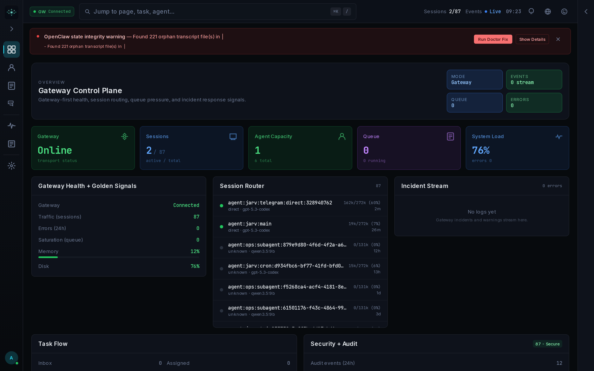
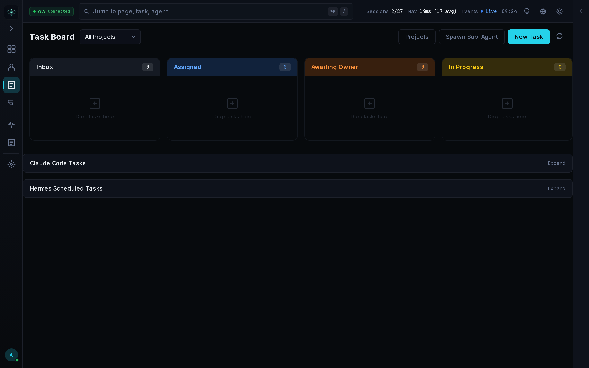
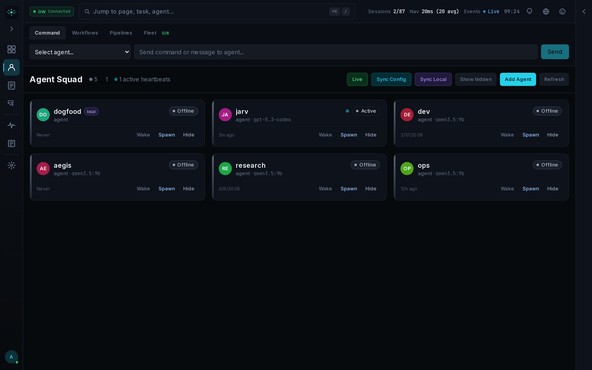
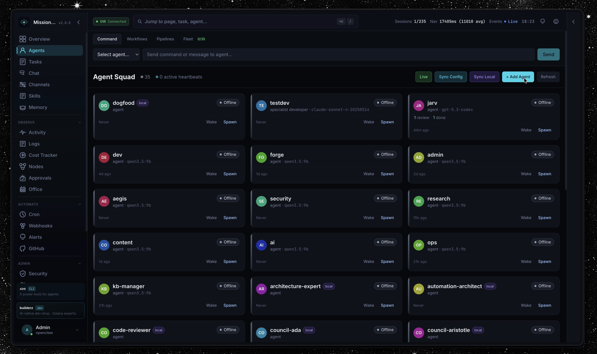
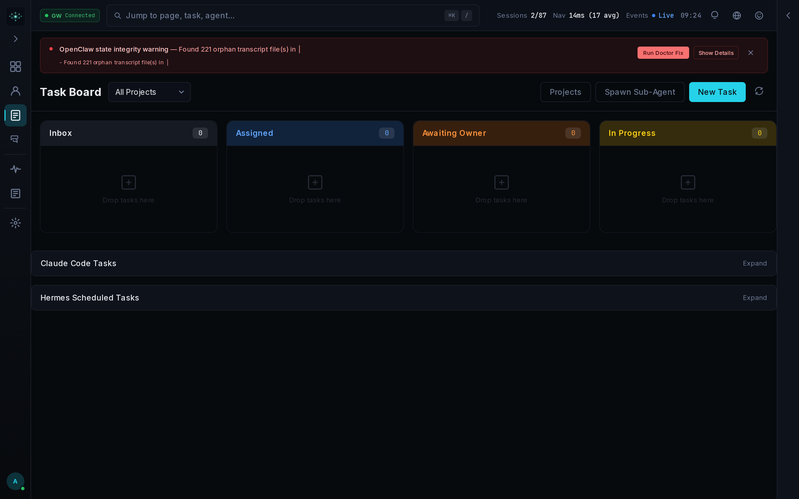

<div align="center">

# 🐾 🤖 ⚡ 🧠 📊 🔐

<br/>

# OpenClaw Mission Control

### The open-source command center for your AI agent fleet

<br/>

[](https://opensource.org/licenses/MIT)
[](https://nextjs.org/)
[](https://react.dev/)
[](https://www.typescriptlang.org/)
[](https://www.sqlite.org/)

<br/>

[](https://github.com/psiquis/openclaw-mission-control/stargazers)
[](https://github.com/psiquis/openclaw-mission-control/forks)
[](https://github.com/psiquis/openclaw-mission-control/issues)

<br/>

> ⭐ **If you find this useful, please star this repo — it helps a lot!**
>
> It takes 2 seconds and means the world to the project. Thank you! 🙏

<br/>

</div>

---

<div align="center">

## What is OpenClaw Mission Control?

</div>

**OpenClaw Mission Control** is a production-ready, self-hosted dashboard for orchestrating AI agent fleets. Spawn agents, queue tasks, track token costs, manage memory, audit security — all from a single, beautiful UI. Whether you're running a solo assistant or a swarm of autonomous agents, Mission Control gives you the visibility and control you need.

> Built for developers who deploy AI seriously. Zero vendor lock-in. Runs on your hardware. Costs nothing.

<br/>

---

<div align="center">

## 📸 Screenshots

</div>

<div align="center">

| Overview | Task Board |
|:---:|:---:|
|  |  |

| Agent Fleet | Memory Graph |
|:---:|:---:|
|  |  |

| Cost Tracking | Security Audit |
|:---:|:---:|
|  |  |

| Cron Scheduler | Skills Hub |
|:---:|:---:|
|  |  |

</div>

<br/>

---

<div align="center">

## 📊 By The Numbers

<br/>

<table>
  <tr>
    <td align="center"><strong>32+</strong><br/>UI Panels</td>
    <td align="center"><strong>101</strong><br/>API Routes</td>
    <td align="center"><strong>49</strong><br/>DB Migrations</td>
    <td align="center"><strong>577</strong><br/>Tests Total</td>
    <td align="center"><strong>282</strong><br/>Unit Tests</td>
    <td align="center"><strong>295</strong><br/>E2E Tests</td>
    <td align="center"><strong>6</strong><br/>Framework Adapters</td>
    <td align="center"><strong>0</strong><br/>External Dependencies</td>
  </tr>
</table>

<br/>

</div>

---

<div align="center">

## ✨ Feature Highlights

</div>

<br/>

| Feature | Description |
|:---|:---|
| 🎯 **Task Board** | Kanban-style queue with priorities, retries, deadlines, and live status updates |
| 🤖 **Agent Fleet** | Spawn, pause, and kill agents — monitor heartbeats, capacity, and active sessions in real time |
| 🧠 **Memory Graph** | Visual knowledge graph of agent memories with search, tagging, and relationship mapping |
| 💰 **Cost Tracking** | Per-agent, per-task token usage with model breakdowns, budget alerts, and spend forecasting |
| 🔐 **Security Audit** | API key management, access logs, permission scopes, and threat event timeline |
| ⏰ **Cron Scheduler** | Schedule recurring agent workflows with cron expressions, run history, and failure alerts |
| 📁 **Projects** | Group agents and tasks by project, with per-project dashboards and resource quotas |
| 🗓️ **Schedule View** | Calendar-style view of upcoming and past scheduled runs across all agents |
| 🔧 **Skills Hub** | Register, version, and assign reusable skills to agents — with live invocation logs |
| 📡 **Live AI Status** | Real-time provider status (OpenAI, Anthropic, Gemini, and more) with incident tracking |

<br/>

---

<div align="center">

## 🚀 Quick Start

</div>

### Option 1 — Run Locally

```bash
git clone https://github.com/psiquis/openclaw-mission-control && cd openclaw-mission-control && pnpm install && pnpm dev
```

Then open [http://localhost:3000/setup](http://localhost:3000/setup) to create your admin account.

> **Requirements:** Node.js >= 22, pnpm (`corepack enable`)

<br/>

### Option 2 — Docker (Zero Config)

```bash
docker compose up
```

That's it. No database setup. No secret management. Everything auto-configures on first run.

<br/>

### Option 3 — Production Hardened Docker

```bash
docker compose -f docker-compose.yml -f docker-compose.hardened.yml up -d
```

<br/>

### Option 4 — Guided Install

```bash
bash install.sh --docker
```

<br/>

---

<div align="center">

## 🔄 How It Works

</div>

<br/>

<div align="center">

```
  Step 1            Step 2            Step 3            Step 4
┌──────────┐     ┌──────────┐     ┌──────────┐     ┌──────────┐
│  Deploy  │────▶│  Create  │────▶│  Queue   │────▶│ Monitor  │
│ Dashboard│     │  Agents  │     │  Tasks   │     │Everything│
└──────────┘     └──────────┘     └──────────┘     └──────────┘
    🖥️                🤖               🎯               📊
 Self-host on      Define your      Assign work,     Track costs,
 any machine       agent fleet      set priorities,  memory, logs,
 or cloud VM.      with skills,     deadlines, and   and live agent
 Takes ~60s.       memory, and      retry policies.  health in one
                   personas.                         dashboard.
```

</div>

<br/>

**1. Deploy** — Pull the repo and run `docker compose up` or `pnpm dev`. Mission Control boots with a SQLite database and auto-generates all secrets. No external services required.

**2. Create Agents** — Define your agent fleet through the UI or REST API. Assign each agent a persona, skill set, memory context, and capacity limits.

**3. Queue Tasks** — Push tasks via the UI, CLI, MCP server, or REST API. Set priorities, deadlines, retry counts, and agent targeting. Tasks flow through a visual Kanban board.

**4. Monitor Everything** — Real-time dashboards show agent heartbeats, task throughput, token spend, memory growth, cron execution history, and security events — all in one place.

<br/>

---

<div align="center">

## 🤖 Agent Control Interfaces

</div>

Mission Control ships with **three ways** to connect your agents:

<br/>

### MCP Server (Recommended for Claude Agents)

```bash
# Add to any Claude Code agent:
claude mcp add mission-control -- node /path/to/mission-control/scripts/mc-mcp-server.cjs

# Environment:
MC_URL=http://127.0.0.1:3000 MC_API_KEY=<your-key>
```

**35 tools** covering agents, tasks, sessions, memory, soul, comments, tokens, skills, cron, and status.

<br/>

### CLI

```bash
pnpm mc agents list --json
pnpm mc tasks queue --agent Aegis --max-capacity 2 --json
pnpm mc events watch --types agent,task
```

<br/>

### REST API

Full OpenAPI spec in [`openapi.json`](openapi.json). Interactive docs available at `/docs` when the server is running.

<br/>

---

<div align="center">

## 🏗️ Architecture

</div>

```
openclaw-mission-control/
├── src/
│   ├── app/                    # Next.js App Router — pages & API routes (101 routes)
│   │   ├── api/                # REST API endpoints
│   │   └── (dashboard)/        # UI pages
│   ├── components/             # React UI panels (32+ components)
│   │   ├── agents/             # Agent fleet panels
│   │   ├── tasks/              # Task board & queue
│   │   ├── memory/             # Memory graph & browser
│   │   ├── cost/               # Token cost dashboards
│   │   ├── cron/               # Cron scheduler UI
│   │   ├── security/           # Audit & key management
│   │   └── shared/             # Reusable UI primitives
│   └── lib/                    # Core logic & utilities
│       ├── db/                 # SQLite schema + 49 migrations
│       ├── agents/             # Agent lifecycle management
│       ├── tasks/              # Task queue engine
│       ├── memory/             # Memory graph engine
│       └── auth/               # Authentication & API keys
├── scripts/
│   ├── mc-mcp-server.cjs       # MCP server (35 tools)
│   ├── mc.ts                   # CLI entrypoint
│   └── install.sh              # Guided installer
├── docs/                       # Documentation & screenshots
├── .data/                      # SQLite DB + runtime state (gitignored)
├── docker-compose.yml          # Standard Docker setup
├── docker-compose.hardened.yml # Production hardened overlay
└── openapi.json                # Full REST API spec
```

<br/>

---

<div align="center">

## 🛠️ Tech Stack

</div>

<br/>

<div align="center">

| Layer | Technology | Why |
|:---|:---|:---|
| **Framework** | Next.js 16 (App Router) | Full-stack React with API routes, streaming, and standalone output |
| **UI** | React 19 | Concurrent rendering, server components, and the latest hooks |
| **Language** | TypeScript 5 | End-to-end type safety across API and UI |
| **Database** | SQLite via better-sqlite3 | Zero-dependency, embedded, blazing-fast, portable |
| **Styling** | Tailwind CSS 3 | Utility-first, dark-mode ready, no runtime overhead |
| **State** | Zustand | Minimal, scalable client state without boilerplate |
| **Testing** | Vitest + Playwright | 282 unit tests + 295 E2E tests |
| **Package Mgr** | pnpm | Fast, disk-efficient, strict dependency resolution |

</div>

<br/>

---

<div align="center">

## ⚙️ Configuration

</div>

All configuration is done via environment variables. Secrets auto-generate on first run.

```bash
# Core
AUTH_SECRET=...              # JWT secret (auto-generated)
API_KEY=...                  # Master API key (auto-generated)

# Optional admin seeding
AUTH_USER=admin
AUTH_PASS=your-password      # Quote if it contains #

# Data location
MISSION_CONTROL_DATA_DIR=.data/   # Change DB and runtime state directory

# Deployment
NEXT_PUBLIC_GATEWAY_OPTIONAL=true  # For standalone deployments without gateway
```

<br/>

---

<div align="center">

## 🧪 Testing

</div>

```bash
pnpm test           # Unit tests (Vitest) — 282 tests
pnpm test:e2e       # End-to-end (Playwright) — 295 tests
pnpm typecheck      # TypeScript strict check
pnpm lint           # ESLint
pnpm test:all       # Full suite: lint + typecheck + test + build + e2e
```

<br/>

---

<div align="center">

## 🤝 Contributing

</div>

Contributions are warmly welcome. Here's how to get started:

1. **Fork** the repository
2. **Clone** your fork: `git clone https://github.com/YOUR_USERNAME/openclaw-mission-control`
3. **Install** dependencies: `pnpm install`
4. **Create** a feature branch: `git checkout -b feat/your-feature`
5. **Make** your changes and write tests
6. **Run** the full suite: `pnpm test:all`
7. **Commit** using Conventional Commits: `feat:`, `fix:`, `docs:`, `test:`, `refactor:`, `chore:`
8. **Open** a Pull Request against `main`

Please open an issue first for large changes so we can discuss the approach. Bug reports, feature requests, and documentation improvements are all equally appreciated.

<br/>

---

<div align="center">

## 📄 License

</div>

<div align="center">

Released under the **MIT License** — free to use, modify, and distribute.

See [`LICENSE`](LICENSE) for details.

<br/>

---

<br/>

**OpenClaw Mission Control** — Built with ❤️ for the AI engineering community.

<br/>

[](https://github.com/psiquis/openclaw-mission-control/stargazers)

*If this project helped you ship something awesome, please consider giving it a star!*

</div>
