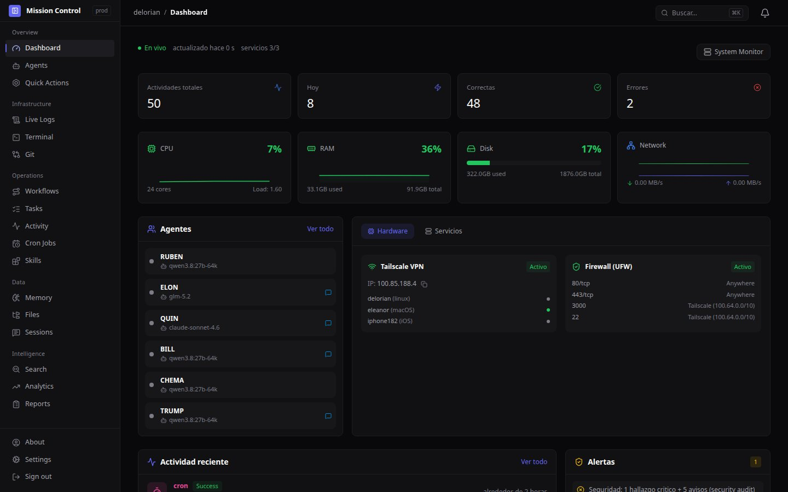
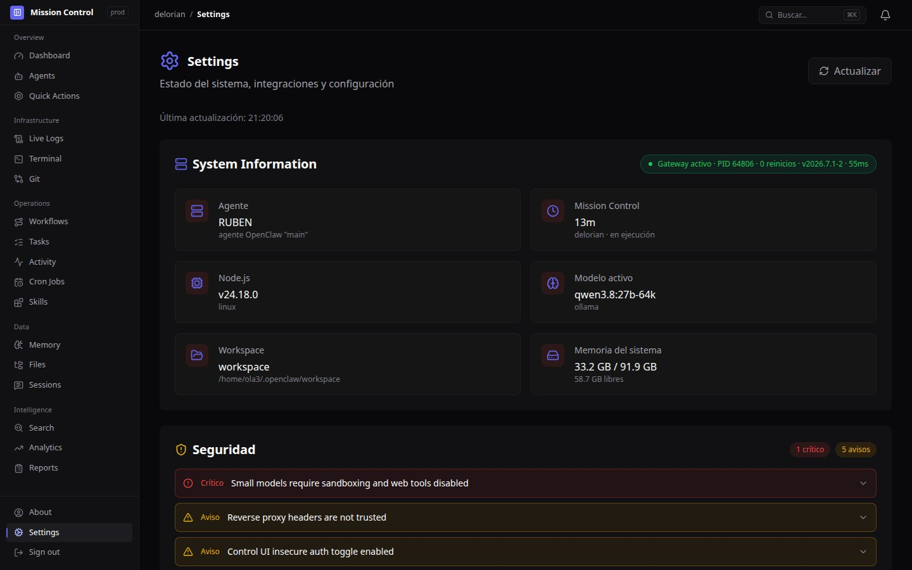
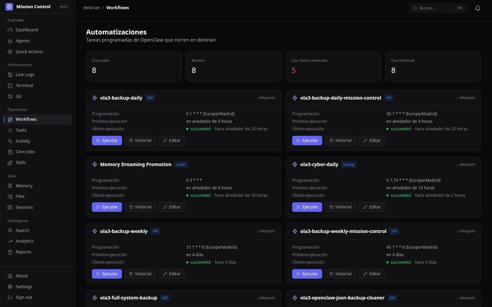
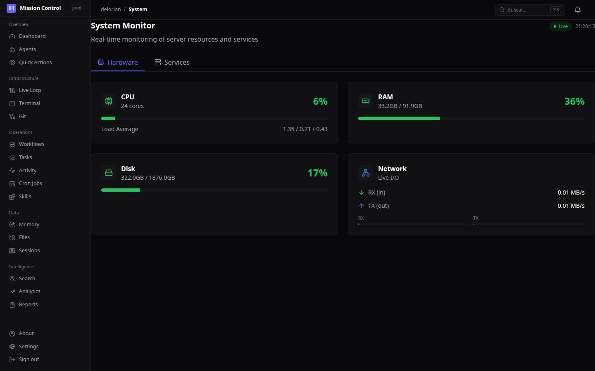
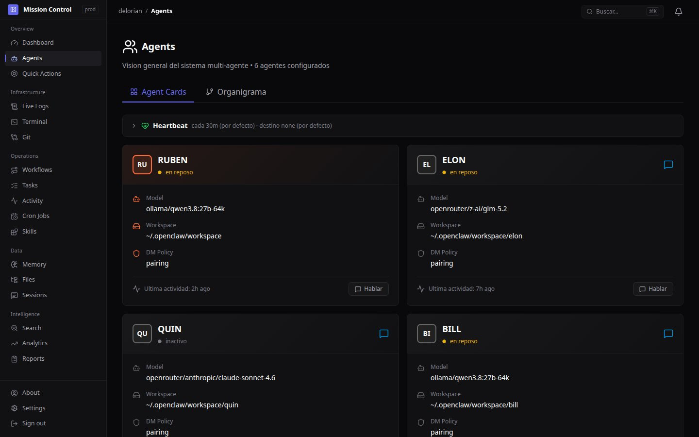
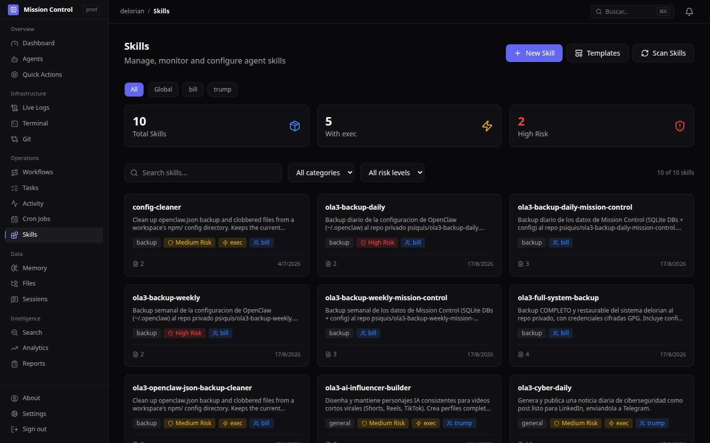
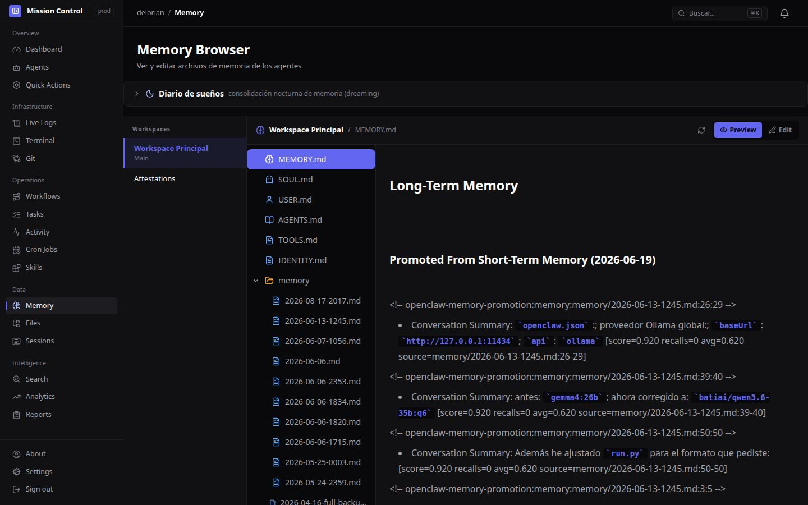
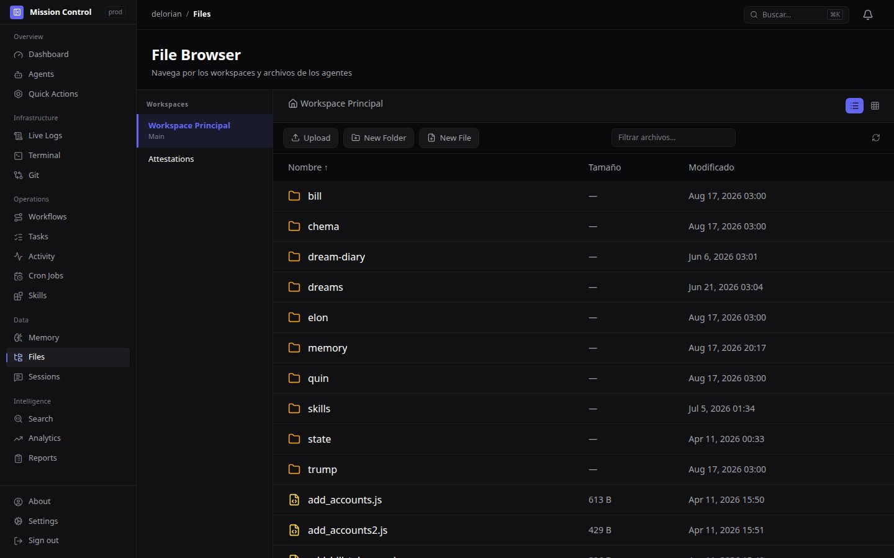
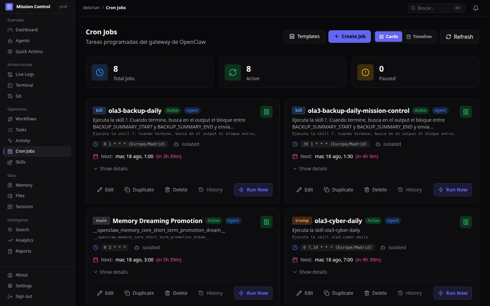

<div align="center">


# OpenClaw Mission Control

### The command center for your OpenClaw AI agent fleet

[](https://nextjs.org)
[](https://www.typescriptlang.org)
[](https://tailwindcss.com)
[](https://sqlite.org)
[](LICENSE)
[](https://github.com/openclaw/openclaw)
[](https://github.com/psiquis/openclaw-mission-control/releases)

**One dashboard for every agent, cron job, skill, and gateway you run with [OpenClaw](https://github.com/openclaw/openclaw).**
Real gateway telemetry · Built-in security audits · Smart cron scheduling · Full observability — self-hosted, no SaaS, your data never leaves your box.

[Quick Start](#-quick-start) · [Features](#-features) · [Screenshots](#-screenshots) · [Architecture](#-architecture) · [Contributing](#-contributing) · [Changelog](CHANGELOG.md)

</div>

---

## Why Mission Control?

If you run [OpenClaw](https://github.com/openclaw/openclaw) agents on a server, VPS, or homelab box, you already know the pain: checking whether the gateway is alive means SSH-ing in and grepping `journalctl`, checking cron jobs means opening `openclaw.json` by hand, and there's no single place to see what your agents are actually doing right now.

Mission Control is a self-hosted Next.js dashboard that sits on top of the OpenClaw CLI and gateway and gives you all of that in a browser tab — on desktop or your phone. No cloud account, no telemetry, no vendor lock-in: it's your server, your agents, your data.

---

## ✨ What's New

> **v0.4.0** — August 2026 — *the "pro-minimal" redesign*

- 🎨 **Full visual redesign** — a calmer, denser, pro-minimal UI built on CSS custom properties, consistent across every page
- 🩺 **Real gateway telemetry** — Settings and System pages now read live data straight from `openclaw status --json`: gateway reachability, PID, restarts, latency, active model, and agent identity — zero hardcoded/placeholder values
- 🔐 **Built-in Security Audit card** — surfaces `openclaw security audit --json` findings (critical/warn/info) with remediation hints, right on the Settings page
- ⚡ **Working Quick Actions** — restart the gateway or tail its logs from the UI, backed by real systemd calls (correctly scoped between `--user` and system-wide services)
- 🧵 **Workflows / Automations page** — a single, OpenClaw-only view of every scheduled task, no other automation engine required
- 🔑 **Fixed password change flow** — now actually persists and restarts the app for you
- 🌍 **Fully brandable** — every user-facing label (agent name, company, hostname breadcrumb) comes from `.env.local`, nothing is hardcoded to a specific deployment anymore

<details>
<summary>Previous releases</summary>

> **v0.3.0** — May 2026

- 🖥️ **System Cron Jobs** — New section on the `/cron` page to view and manage the system crontab — add, edit, and delete entries inline with human-readable schedule descriptions
- 🗑️ **Delete button in Cron Modal** — Delete any OpenClaw cron job directly from its edit modal, no need to go back to the list
- 🌐 **New API** — `GET/POST/PUT/DELETE /api/cron/system` for full system crontab management

> **v0.3.0** — April 2026

- 🔧 **Smart Cron Presets** — One-click task profiles: _Script directo_, _Tarea de agente_, _Respuesta simple_, or fully custom
- 💡 **Inline Tooltips** — Contextual `ℹ️` hints on every cron field so you never misconfigure a job
- 📢 **Simplified Delivery** — Single checkbox to route results to Telegram, auto-configured per agent
- ⚡ **Run Now Fix** — Instant manual cron execution from the dashboard
- 📊 **Weekly Timeline** — Visual cron schedule across the week
- 🗂️ **Cron Templates** — 8 pre-built automation templates ready to deploy
- 🎯 **Cron Categories** — Organize jobs by type (backup, monitoring, content, etc.)

</details>

---

## 📸 Screenshots

<table>
<tr>
<td width="50%">

**Dashboard — Fleet Overview**

*Real-time agent status, activity feed, weather, and system metrics*

</td>
<td width="50%">

**Settings — Live Gateway & Security**

*Real gateway health, active model, security audit findings, and working quick actions*

</td>
</tr>
<tr>
<td>

**Workflows — OpenClaw Automations**

*Every scheduled task in one place — OpenClaw only, no extra moving parts*

</td>
<td>

**System Monitor**

*CPU, RAM, disk, and per-service status with start/stop/restart/logs*

</td>
</tr>
<tr>
<td>

**Agent Fleet**

*Multi-agent overview with models, status, and configuration*

</td>
<td>

**Skill Registry**

*SQLite-backed inventory with risk assessment and category detection*

</td>
</tr>
<tr>
<td>

**Memory Search**

*Semantic search across agent memory databases*

</td>
<td>

**File Browser**

*Navigate and edit workspace files with Monaco editor*

</td>
</tr>
<tr>
<td colspan="2">

**Cron Scheduler**

*Full cron management with smart presets, tooltips, and a visual weekly timeline*

</td>
</tr>
</table>

---

## 🚀 Features

### 🩺 Live Gateway & Security
- Real-time gateway health straight from the OpenClaw CLI — reachability, PID, restarts, latency, version
- Active model and agent identity, no hardcoded placeholders
- **Security Audit card** — critical/warn/info findings from `openclaw security audit`, with remediation hints
- One-click gateway restart and log viewer, wired to the correct systemd scope (`--user` vs system-wide)

### 🤖 Agent Fleet Management
- Live status dashboard with model info and connection state
- Per-agent workspace browsing and memory search
- Agent organigram visualization
- Real-time activity feed with type filtering

### ⏰ Smart Cron & Workflows
- **Workflows page** — every OpenClaw scheduled task in one unified, OpenClaw-only view
- **Dual cron view** — OpenClaw jobs (top) + System crontab (bottom) in a single unified page
- **System Cron Management** — Add, edit, and delete system crontab entries directly from the UI
- **Smart Presets** — Choose a task profile and let the system configure thinking, context, tools, and timeout:

  | Preset | Thinking | Context | Tools | Timeout | Best for |
  |--------|----------|---------|-------|---------|----------|
  | 🔧 Script directo | Off | Light | exec, read, write | 180s | Bash/Python scripts |
  | 🤖 Tarea de agente | Default | Full | All | 600s | Complex reasoning tasks |
  | 📝 Respuesta simple | Off | Light | None | 120s | Text-only responses |
  | ⚙️ Personalizado | Custom | Custom | Custom | Custom | Full manual control |

- **Inline Tooltips** — Every field has an `ℹ️` icon explaining what it does and recommended values
- **One-click Delivery** — Toggle to route results via Telegram, auto-configured per agent
- **Visual Builder** — Frequency modes (minutely, hourly, daily, weekly, monthly) with cron preview
- **Weekly Timeline** — See all jobs plotted across the week
- **Templates** — 8 pre-built templates (backups, health checks, cleanups, reporting)
- **Run Now** — Instantly trigger any job from the dashboard

### 🧩 Skill Operating System
- **Skill Registry** — SQLite-backed with automatic risk assessment and category detection
- **Skill Detail View** — SKILL.md preview, file tree, agent assignment, invocation history
- **Skill Templates** — 7 built-in templates with guided creation wizard
- **Risk Assessment** — Detects `sudo`, `rm -rf`, elevated commands, and secrets

### 📊 Observability
- Real-time CPU, RAM, disk, and per-service monitoring (PM2 + systemd, both user and system scope)
- Session history with token usage tracking
- Activity heatmaps and usage analytics
- Live log streaming
- Cost tracking per model/provider

### 🛠️ Power Tools
- **File Browser** — Navigate and edit files with Monaco editor
- **Memory Search** — Semantic search across all agent memory DBs
- **Web Terminal** — Browser-based terminal access
- **Global Search** — Search across files, memory, sessions, and skills
- **Git Integration** — Repository status and recent commits
- **PWA** — Install as a Progressive Web App

---

## 📦 Quick Start

### Prerequisites

- [Node.js](https://nodejs.org) 22+
- [OpenClaw](https://github.com/openclaw/openclaw) installed and running (Mission Control shells out to the `openclaw` CLI — it doesn't replace it)
- Linux/macOS (tested on Ubuntu 24.04, Raspberry Pi OS)

### Install

```bash
git clone https://github.com/psiquis/openclaw-mission-control.git
cd openclaw-mission-control
npm install
```

### Configure

```bash
cp .env.example .env.local
```

```env
# Required
ADMIN_PASSWORD=your-secure-password
AUTH_SECRET=$(openssl rand -base64 32)
OPENCLAW_DIR=/home/your-user/.openclaw

# Optional — Branding (shown across the whole UI, including the breadcrumb)
NEXT_PUBLIC_AGENT_NAME=Mission Control
NEXT_PUBLIC_APP_TITLE=Mission Control
NEXT_PUBLIC_COMPANY_NAME=Your Company
```

### Run

```bash
# Development
npm run dev

# Production
npm run build && npm start
```

Open `http://localhost:3000`

### Docker

```bash
docker build -t mission-control .
docker run -d -p 3000:3000 \
  -v ~/.openclaw:/root/.openclaw:ro \
  -e ADMIN_PASSWORD=your-password \
  -e AUTH_SECRET=$(openssl rand -base64 32) \
  mission-control
```

### PM2 (recommended for production)

```bash
npm run build
pm2 start "npm start" --name mission-control
pm2 save
```

---

## 🏗️ Architecture

```
mission-control/
├── src/
│   ├── app/                    # Next.js App Router
│   │   ├── (dashboard)/        # Dashboard pages
│   │   │   ├── cron/           # Cron jobs + templates
│   │   │   ├── workflows/      # OpenClaw automations overview
│   │   │   ├── skills/         # Skill management
│   │   │   ├── agents/         # Agent fleet
│   │   │   ├── sessions/       # Session history
│   │   │   ├── system/         # System monitoring
│   │   │   ├── settings/       # Gateway health, security audit, quick actions
│   │   │   ├── files/          # File browser
│   │   │   ├── memory/         # Memory search
│   │   │   ├── costs/          # Cost analytics
│   │   │   └── ...
│   │   ├── api/                # API routes
│   │   └── login/              # Auth
│   ├── components/             # React components
│   └── lib/                    # Business logic + DB
├── data/                       # SQLite databases (auto-created)
├── public/                     # Static assets
└── docs/                       # Documentation + screenshots
```

### Tech Stack

| Layer | Technology |
|-------|-----------|
| Framework | Next.js 16 (App Router, Turbopack) |
| Language | TypeScript 5 |
| Styling | Tailwind CSS 4 + CSS Variables |
| Database | SQLite via better-sqlite3 (WAL mode) |
| Icons | Lucide React |
| Charts | Recharts |
| Editor | Monaco Editor |
| Fonts | Inter + Sora + JetBrains Mono |

### Data Flow

```
Browser  ←→  Next.js API Routes  ←→  OpenClaw CLI / SQLite / Filesystem
                                            ↓
                                   OpenClaw Gateway
                        (agents, cron, sessions, models, security audit)
```

Mission Control never talks to the gateway's WebSocket directly for admin actions — it shells out to the `openclaw` CLI (`status`, `security audit`, `config get/patch`) using `execFile`, and manages services through `systemctl`/`pm2`, scoped correctly between per-user and system-wide units. It reads/writes:

| Path | Purpose |
|------|---------|
| `~/.openclaw/openclaw.json` | Agent and model configuration |
| `~/.openclaw/cron/jobs.json` | Cron job definitions |
| `~/.openclaw/agents/` | Agent sessions and config |
| `~/.openclaw/workspace/` | Agent workspaces |
| `~/.openclaw/skills/` | Custom skills |
| `~/.openclaw/memory/` | Agent memory DBs |
| `data/*.db` | Local registry (skills, templates, activities) |

---

## 🎨 Customization

### Branding

All branding via environment variables — zero code changes:

```env
NEXT_PUBLIC_AGENT_NAME=My Dashboard
NEXT_PUBLIC_COMPANY_NAME=My Company
NEXT_PUBLIC_APP_TITLE=Control Center
```

### Theme

Override CSS variables in `src/app/globals.css`:

```css
:root {
  --accent: #6366F1;       /* Primary accent */
  --bg: #09090B;           /* Background */
  --surface: #111113;      /* Card surfaces */
  --text-primary: #FAFAFA; /* Primary text */
}
```

---

## 🤝 Contributing

Contributions welcome — bug reports, feature ideas, and PRs alike. Open an issue first for anything non-trivial so we can discuss the approach.

```bash
git clone https://github.com/psiquis/openclaw-mission-control.git
cd openclaw-mission-control
npm install
npm run dev    # http://localhost:3000
```

If Mission Control is useful to you, consider giving the repo a ⭐ — it helps other OpenClaw users find it.

---

## 📄 License

MIT — see [LICENSE](LICENSE).

---

<div align="center">

Built for [OpenClaw](https://github.com/openclaw/openclaw) · Made by [psiquis](https://github.com/psiquis)

*Ship agents, not anxiety.*

</div>
